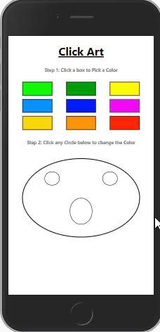
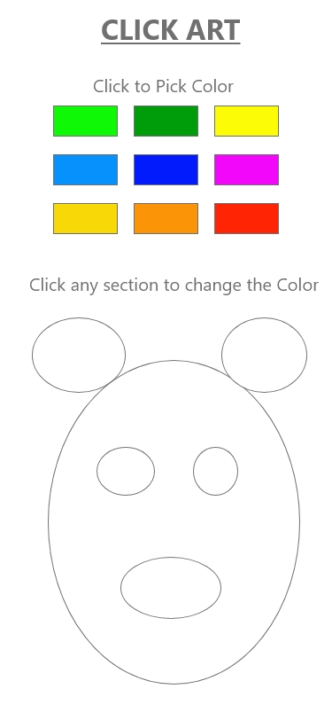

# Click-Art

### Table of Contents

1. Project Demo Link
2. Purpose
3. Motivation
4. Wireframe
5. How to play
6. Technologies Used

### Project Demo Link: [BlackJack App](https://smiley-blackjack-game.netlify.app/)

### Purpose:

Kids coloring web app created with React

### Motivation:

The goal was to practice building apps in shorter time periods with React.

### WireFrame

### How to play:

- User will click on a color pallette to select a color
- User will click on a circle to fill in its background color with the selected color

### This app was built with the following technologies:

**React:** JavaScript front-end library for building user interfaces

**Git-Hub:** Web-based version control repository and Internet hosting service

**Abode XD** A wire-framing tool used to create a mockup/visual of what is to be coded

**JavaScript:** Object-oriented programming language for web pages

**HTML:** Mark-up language for creating web pages

**CSS:** A formatting language for styling web pages

_Created by JC Smiley in November of 2020_
